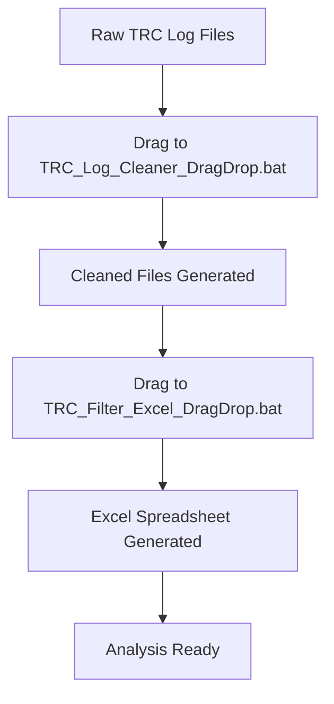

# TRC Log Processing System

A comprehensive Python-based system for processing and analyzing TRC (Transaction Record Chain) log files from game servers. This system cleans, filters, and converts raw TRC logs into organized Excel spreadsheets for easy analysis.

## 📋 Table of Contents

- [Features](#features)
- [File Structure](#file-structure)
- [Requirements](#requirements)
- [Installation](#installation)
- [Usage](#usage)
- [Workflow](#workflow)
- [Supported Log Types](#supported-log-types)
- [Troubleshooting](#troubleshooting)
- [Advanced Usage](#advanced-usage)

## ✨ Features

- **🧹 Log Cleaning**: Remove `\N` null entries from TRC log files
- **📊 Excel Export**: Convert logs to organized Excel spreadsheets
- **🎯 Drag & Drop**: Windows Explorer drag & drop support
- **🔄 Batch Processing**: Process multiple files simultaneously
- **📈 Multiple Log Types**: Support for trades, auctions, mail, guild warehouse, etc.
- **⚡ Fast Processing**: Optimized for large log files
- **🛡️ Error Handling**: Robust error handling and validation
- **📋 Progress Tracking**: Real-time processing status

## 📁 File Structure

```
trc_files/
├── trc_log_cleaner.py              # Main log cleaning script
├── TRC_Filter_Excel_3.py           # Excel export script
├── TRC_Log_Cleaner_DragDrop.bat    # Drag & drop launcher for cleaner
├── TRC_Filter_Excel_DragDrop.bat   # Drag & drop launcher for Excel export
├── __pycache__/                    # Python cache files
└── README.md                       # This documentation
```

## 🔧 Requirements

### System Requirements
- **Python**: 3.6 or higher
- **Operating System**: Windows 10/11 (with drag & drop support)
- **RAM**: 2GB minimum, 4GB recommended for large files
- **Storage**: 2x the size of your log files for processing

### Python Dependencies
```bash
pip install xlsxwriter argparse pathlib
```

## 🚀 Installation

1. **Clone or Download** the TRC processing system to your local machine
2. **Install Dependencies**:
   ```bash
   pip install xlsxwriter
   ```
3. **Verify Installation**:
   ```bash
   python trc_log_cleaner.py
   python TRC_Filter_Excel_3.py
   ```

## 📖 Usage

### Method 1: Drag & Drop (Recommended)

#### For Log Cleaning:
1. Locate your TRC log files (`.GameLog` files)
2. Drag and drop them onto `TRC_Log_Cleaner_DragDrop.bat`
3. Wait for processing to complete
4. Find cleaned files with `_cleaned` suffix

#### For Excel Export:
1. Take cleaned log files from previous step
2. Drag and drop them onto `TRC_Filter_Excel_DragDrop.bat`
3. Wait for Excel generation
4. Open the generated `.xlsx` file

### Method 2: Command Line

#### Log Cleaning:
```bash
# Single file
python trc_log_cleaner.py WorldSvr_01_01_250828.GameLog

# Multiple files
python trc_log_cleaner.py file1.GameLog file2.GameLog file3.GameLog

# Custom output
python trc_log_cleaner.py input.GameLog output_cleaned.GameLog
```

#### Excel Export:
```bash
# Single file
python TRC_Filter_Excel_3.py WorldSvr_01_01_250828_cleaned.GameLog

# Multiple files
python TRC_Filter_Excel_3.py file1_cleaned.GameLog file2_cleaned.GameLog
```

## 🔄 Workflow

### Complete Processing Pipeline:



### Step-by-Step Example:

1. **Input**: `WorldSvr_01_01_250828.GameLog` (500MB raw log)
2. **Clean**: Drag to `TRC_Log_Cleaner_DragDrop.bat`
   - Output: `WorldSvr_01_01_250828_cleaned.GameLog` (200MB cleaned)
3. **Export**: Drag cleaned file to `TRC_Filter_Excel_DragDrop.bat`
   - Output: `WorldSvr_01_01_250828_cleaned.GameLog.xlsx`
4. **Result**: Organized Excel with separate sheets for each log type

## 📊 Supported Log Types

The system processes the following TRC log event types:

### Trade Logs
- **5131**: Item trading between players
- **5203**: Alz (currency) trading

### Commerce Logs
- **5115**: Personal shop transactions
- **51044**: Auction house transactions

### Guild & Storage
- **51049**: Guild warehouse item movements
- **10953**: Guild warehouse alz transactions

### Communication
- **51019**: Mail item sending
- **5361**: Mail alz sending

### Game Actions
- **5101**: Item throwing/dropping
- **5102**: Item picking up
- **51022**: Dungeon entries
- **6167**: Dungeon starts

### Connection Logs
- **9**: Player disconnections
- **9103**: Player channel entries

## 🔍 Excel Output Structure

Generated Excel files contain the following sheets:

| Sheet Name | Purpose | Typical Content |
|------------|---------|-----------------|
| **Trade_Log** | Player-to-player trades | Timestamps, character IDs, items, prices |
| **PersonalShop_Log** | Personal shop transactions | Seller, buyer, items, prices |
| **AuctionHouse_Log** | Auction house activity | Buyers, sellers, items, final prices |
| **GuildWarehouse_Log** | Guild storage activity | Deposits, withdrawals, items |
| **Mail_Log** | Mail system activity | Senders, receivers, items, attachments |
| **Throw_Log** | Item drops/pickups | Characters, items, locations |
| **No_Entry_Hack_Log** | Connection events | Logins, logouts, dungeon entries |

## ⚙️ Configuration Options

### TRC_Filter_Excel_3.py Settings

```python
# Enable/disable throw/pickup logging (can be slow for large files)
enablethrowlog = '1'  # Set to '0' to disable
```

### Performance Tuning

- **Large Files**: Enable throw logging only when needed (very slow)
- **Memory**: Ensure 4GB+ RAM for files over 100MB
- **Storage**: Keep 2x file size free space for processing

## 🛠️ Troubleshooting

### Common Issues

#### 1. "Python is not recognized"
**Solution**: Install Python and add to PATH, or use full path:
```bash
C:\Python\python.exe trc_log_cleaner.py input.GameLog
```

#### 2. "Module not found: xlsxwriter"
**Solution**: Install required packages:
```bash
pip install xlsxwriter
```

#### 3. "Permission denied" or "File in use"
**Solution**: Close Excel files before processing, ensure write permissions

#### 4. "Memory error" with large files
**Solution**: Process files individually, or increase system RAM

#### 5. Drag & Drop not working
**Solution**: Right-click .bat files → "Run as administrator"

### Error Messages

| Error | Cause | Solution |
|-------|-------|----------|
| `No files provided` | No files dragged | Drag files onto .bat files |
| `Input file not found` | Wrong file path | Check file location and name |
| `Unicode decode error` | File encoding issue | Files should be UTF-8 compatible |
| `IndexError` | Corrupted log format | Check log file integrity |

## 📈 Advanced Usage

### Batch Processing Multiple Servers

```bash
# Process all server logs at once
python trc_log_cleaner.py WorldSvr_*.GameLog AgentShop_*.GameLog

# Generate combined Excel report
python TRC_Filter_Excel_3.py *_cleaned.GameLog
```

### Custom Output Directories

```bash
# Specify output location
python trc_log_cleaner.py input.GameLog "C:\Processed\output_cleaned.GameLog"
```

### Automation with Task Scheduler

Create Windows Task Scheduler tasks to:
- Automatically clean logs daily
- Generate weekly Excel reports
- Archive old processed files

### Integration with Other Tools

The cleaned log files can be used with:
- Database import tools
- Custom analysis scripts
- Log aggregation systems
- Monitoring dashboards

## 📝 File Naming Convention

### Input Files
- `WorldSvr_01_01_250828.GameLog` - World server logs
- `AgentShop_01_250824.GameLog` - Shop server logs
- `LoginSvr_01_01_250828.GameLog` - Login server logs

### Output Files
- `WorldSvr_01_01_250828_cleaned.GameLog` - Cleaned logs
- `WorldSvr_01_01_250828_cleaned.GameLog.xlsx` - Excel reports
- `WorldSvr_01_01_250828_combined.xlsx` - Multi-file reports

## 🔒 Security & Performance

### Security Considerations
- Scripts only read input files, never modify originals
- No network connections or external data transmission
- Safe for processing sensitive game server logs

### Performance Optimization
- **File Size**: Process large files individually
- **Memory Usage**: ~2x file size during processing
- **Processing Speed**: ~10,000 lines per second (depends on hardware)
- **Excel Generation**: ~5,000 entries per second

## 📞 Support

### Getting Help
1. Check this README for common issues
2. Verify all requirements are installed
3. Test with small sample files first
4. Check file permissions and paths

### Reporting Issues
When reporting problems, include:
- Python version (`python --version`)
- Error messages (full output)
- Sample input file (first 10 lines)
- System specifications

## 📋 Changelog

### Version 3.1 (Current)
- ✅ Drag & drop support for Windows
- ✅ Batch file processing
- ✅ Improved error handling
- ✅ Updated for cleaned log format
- ✅ Fixed 5101/5102 event type differences
- ✅ Enhanced progress reporting


---

**🎮 Happy Gaming Analytics!**

*This system helps game administrators and analysts process TRC logs efficiently for player behavior analysis, economy monitoring, and server performance insights.*

*This update for fully support EP33/35

*For EP8 Please use TRC_Filter_Excel_3_EP8.py

Credits to @PwrDex for source
